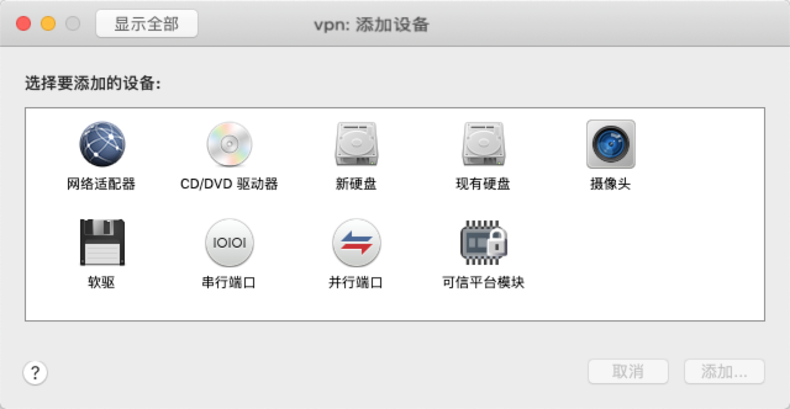
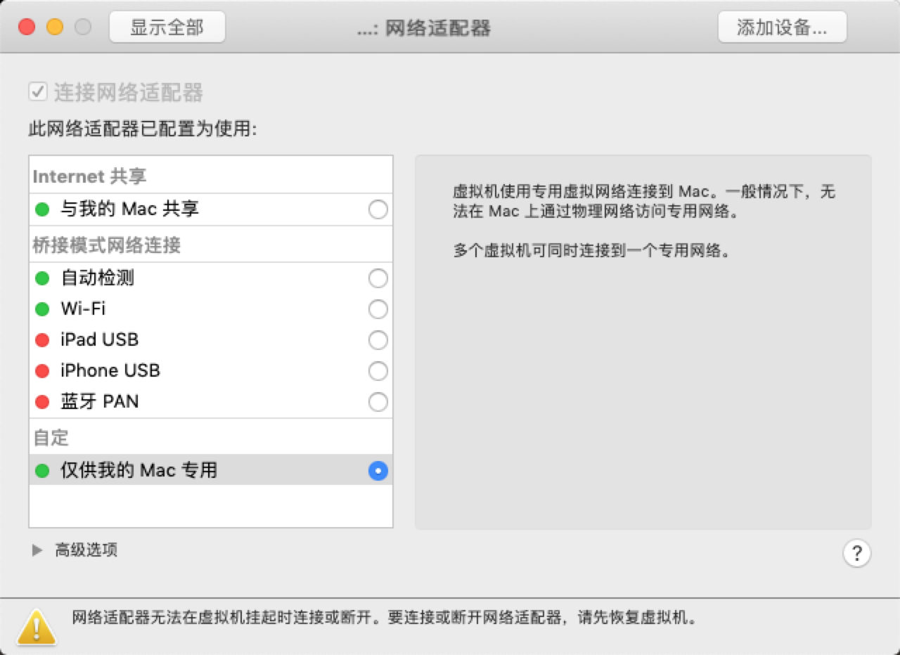
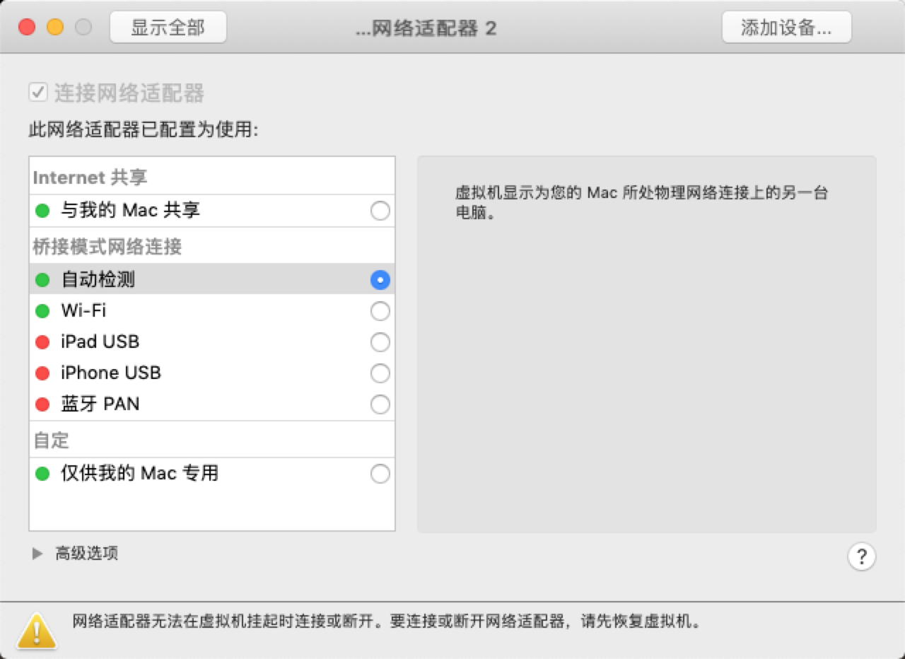
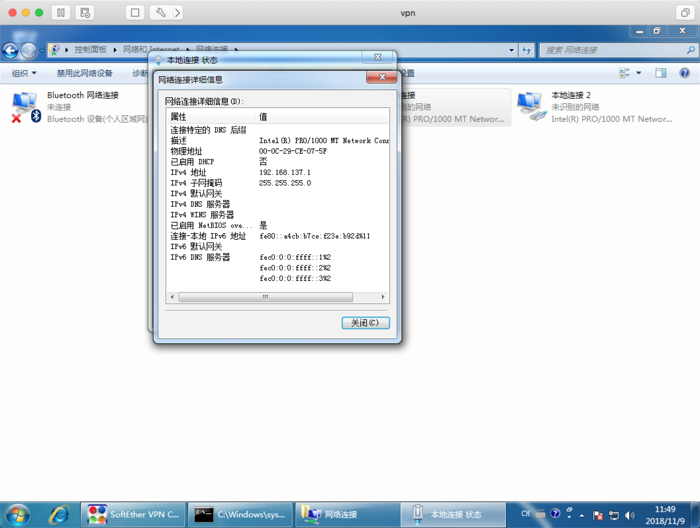
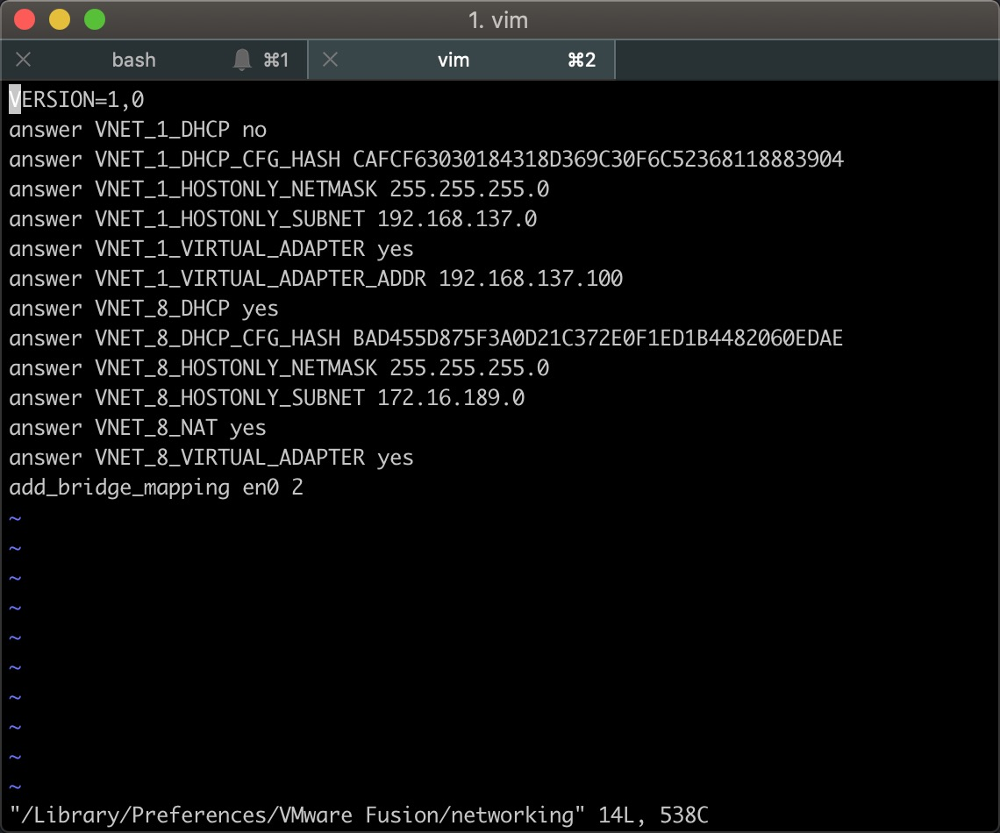
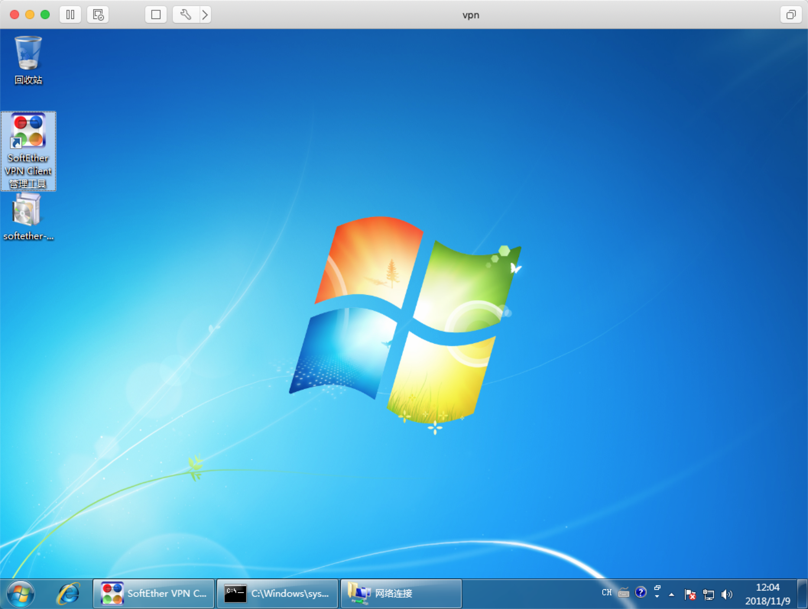
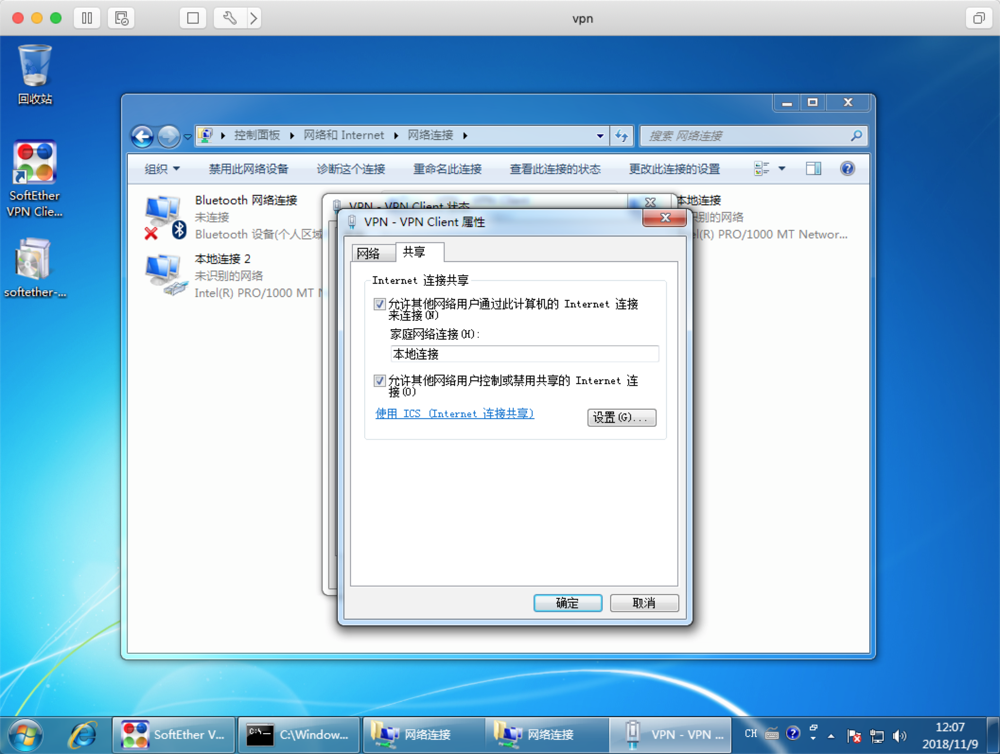

#虚拟机vpn分享宿主机教程
##背景
>OSX升级Mojave之后,公司的vpn服务端没有升级,导致OSX无法连接VPN.
>指望公司及时升级vpn服务端也不现实,作为一个java码农,只好自己动手来解决
##解决方案
>用虚拟机来负责vpn拨号,分享给宿主机使用,一劳永逸解决问题
##实验环境
> 1. VMware Fusion 10.1.3
> 2. Windows 7 32位
> 3. SoftEther VPN Client 管理工具
> 4. macOS Mojave 10.14.1 (18B75)

##操作步骤
1.安装虚拟机  
2.添加设备新增一块网卡  

2.1网络适配器1 配置  

网卡1设置为HostOnly  
2.2网络适配器2 配置  

网卡2设置为桥接  
3.查看虚拟机HostOnly网卡配置  
  
一般应该是192.168.137.1, 如果不是也没关系,记住这个ip  
4.查看修改宿主机HostOnly网卡配置  
```shell
sudo vim /Library/Preferences/VMware\ Fusion/networking
```  
  
 ```shell
 answer VNET_1_DHCP no
 answer VNET_1_HOSTONLY_NETMASK 255.255.255.0
 answer VNET_1_HOSTONLY_SUBNET 192.168.137.0 #修改成步骤3中HostOnly网卡IP为同一网段
 answer VNET_1_VIRTUAL_ADAPTER_ADDR 192.168.137.100 #随意设置为该网段的一台ip
 ```

 5.vpn客户端安装
 

 6.设置vpn虚拟网卡为共享  
   
 配置完成后,在虚拟机中连接vpn获取到vpn分配的虚拟ip  
 7.为宿主机增加路由  
 将虚拟机中vpn的虚拟ip在宿主机中增加路由,以及你要访问的服务的ip
 ```shell
 sudo route add -net <IP/NETMASK> <VM HostOnly IP>
 #示例
 sudo route add -net 192.168.106.0/24 192.168.137.1
 sudo route add -net 192.168.10.0/24 192.168.137.1
 ```
 8.测试  
 在宿主机打开VPN内网地址
 
 成功～
